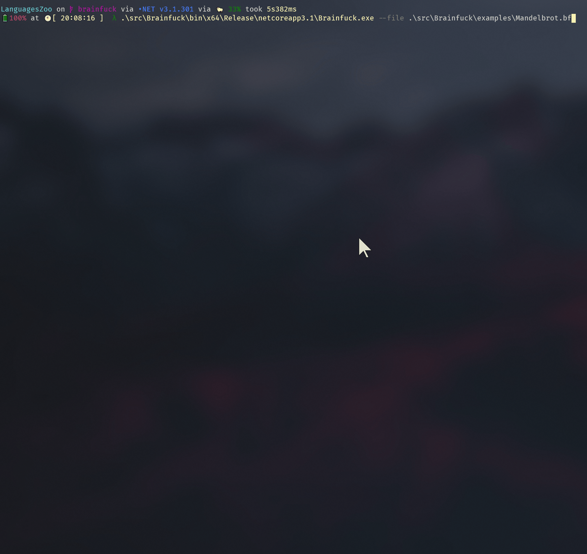

# Brainfuck

> Brainfuck is an esoteric programming language created in 1993 by Urban Müller, and is notable for its extreme minimalism.

For the specification, see its Wikipedia's [page](https://en.wikipedia.org/wiki/Brainfuck#Commands).

## Build

Simply run `dotnet build`, or `dotnet build -c Release` for Release product.

## Usage

After building, run `/path/to/Brainfuck.exe --file /path/to/BrainfuckCode`

